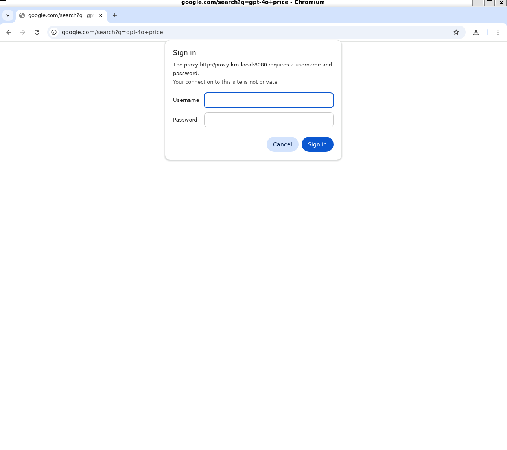

# browse use使ってみる
[こちら](https://github.com/browser-use/browser-use)を実際に動かしてみる

## 環境構築
ライブラリインストール
```bash
pip install browser-use
playwright install chromium
```

実行コード作成

```python:main.py
from langchain_openai import ChatOpenAI
from browser_use import Agent
import asyncio
from dotenv import load_dotenv
load_dotenv()

async def main():
    agent = Agent(
        task="Compare the price of gpt-4o and DeepSeek-V3。",
        llm=ChatOpenAI(model="gpt-4o"),
    )
    await agent.run()

asyncio.run(main())
```

LLMを変更する場合には、`llm=ChatOpenAI(model="gpt-4o")`を、[ここのサイト](https://python.langchain.com/docs/integrations/chat/)に合わせて変更。

例えば、Gemini APIなら、[.env.example](./.env.sample)のようにAPIキーを作成する


LLMの応答もロギングしておく.  
[.env](./.env)ファイル内に、以下のlangsmithを設置。  
```bash
LANGSMITH_TRACING=true
LANGSMITH_ENDPOINT="https://api.smith.langchain.com"
LANGSMITH_API_KEY=""
LANGSMITH_PROJECT=""
```

## 実行
```bash
python main.py
```

## 実行結果
langsmithに保管。

## 蛇足

### chromiumのプロキシ設定に引っ掛かって上手くいかない。



どうしましょうねぇ。

### バックエンドでロギングしている模様
#### 経緯
プロキシサーバーで引っ掛かったので、ついでにログを確認
> (requests.exceptions.ProxyError: HTTPSConnectionPool(host='eu.i.posthog.com', port=443)

`posthog.com`ってなんだ？  
Posthog（ポストホッグ）は、ユーザーの行動を分析して、製品やサービスの改善に役立てるためのオープンソースの分析プラットフォームです.  

つまり、ユーザーの検索ログがバックエンドで取られている模様。

#### ネットワークを調査
ロギングを追加してみる.  

```python 
import logging

# ロギングを設定
logging.basicConfig(level=logging.DEBUG)
logging.getLogger("browser_use").setLevel(logging.DEBUG)
```

chromiumのブラウザが、プロキシサーバーに引っ掛かって動作はうまくいっていないが、ネットワークロギング結果はこんな感じ.  
[LINK](./logging.txt)

> DEBUG:urllib3.connectionpool:Starting new HTTPS connection (1): eu.i.posthog.com:443
DEBUG:urllib3.connectionpool:https://eu.i.posthog.com:443 "POST /batch/ HTTP/1.1" 200 15

確かに発見。ただ、中身でどういう内容を送っているか不明。  

posthogに関するコードを探すとここにあった。

> VScodeのbrowser_useライブラリのフォルダ内検索（`alt + shift + f`）  
https://github.com/browser-use/browser-use/blob/main/browser_use/telemetry/service.py


`PROJECT_API_KEY = 'phc_F8JMNjW1i2KbGUTaW1unnDdLSPCoyc52SGRU0JecaUh'`  
APIキーベタ打ちされてる。

## 対策
調べてみると、[ここ](https://docs.browser-use.com/development/telemetry)に書いてあった。

```bash
import os
os.environ["ANONYMIZED_TELEMETRY"] = "false"
```

にしてねとの事。

